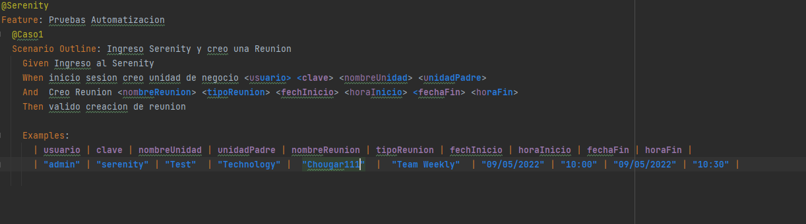
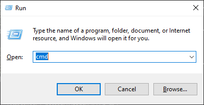
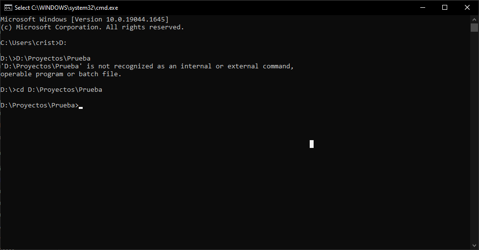
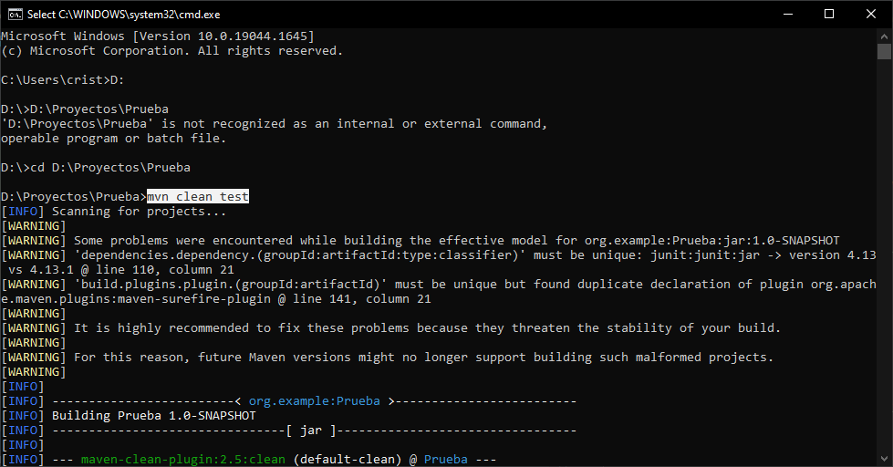
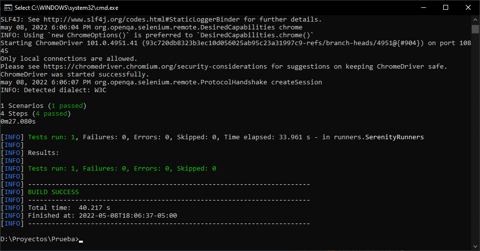

# Serenity Test Choucair

_Realizar la prueba tecnica solicitada por la empresa choucair con el fin de participar en la seleccion del puesto de Autmatizador de pruebas_


### Pre-requisitos 📋

_Que cosas necesitas para instalar el software y como instalarlas_

```
Instalar Software:

    - Java
    - Intellij
    - Maven
    - Git
```
```
Instalar Herramientas de Desarrollo y ejecucion:

    - Dependencias del POM
    - Cucumber
    - ChromeDriver
```

## Ejecutando las pruebas ⚙️

_Como Ejecutar la prueba Automatizada._
1. ingresar a el archivo data.featura en la ruta "Prueba\src\test\resources\features".
2. Ingresar los datos de la prueba


3. Abrir la consola con la tecla windows + R y digitamos cmd


4. Se nos abrira la consola donde digitaremos el comando cd "ruta del proyecto" 



5. Digitar el comando "mvn clean test" para ejecutar la automatizacion.


6. Validamos que la prueba exitosa.




## Construido con 🛠️

* [SerenityBDD](https://serenity-bdd.info/) 
* [Maven](https://maven.apache.org/) 
* [Cucumber](https://cucumber.io/) 

## Autores ✒️

_Menciona a todos aquellos que ayudaron a levantar el proyecto desde sus inicios_

* **Cristan Camilo Buitrago** - *Trabajo Inicial* - [villanuevand](https://github.com/villanuevand)
* **Cristan Camilo Buitrago** - *Documentación* - [fulanitodetal](#fulanito-de-tal)


